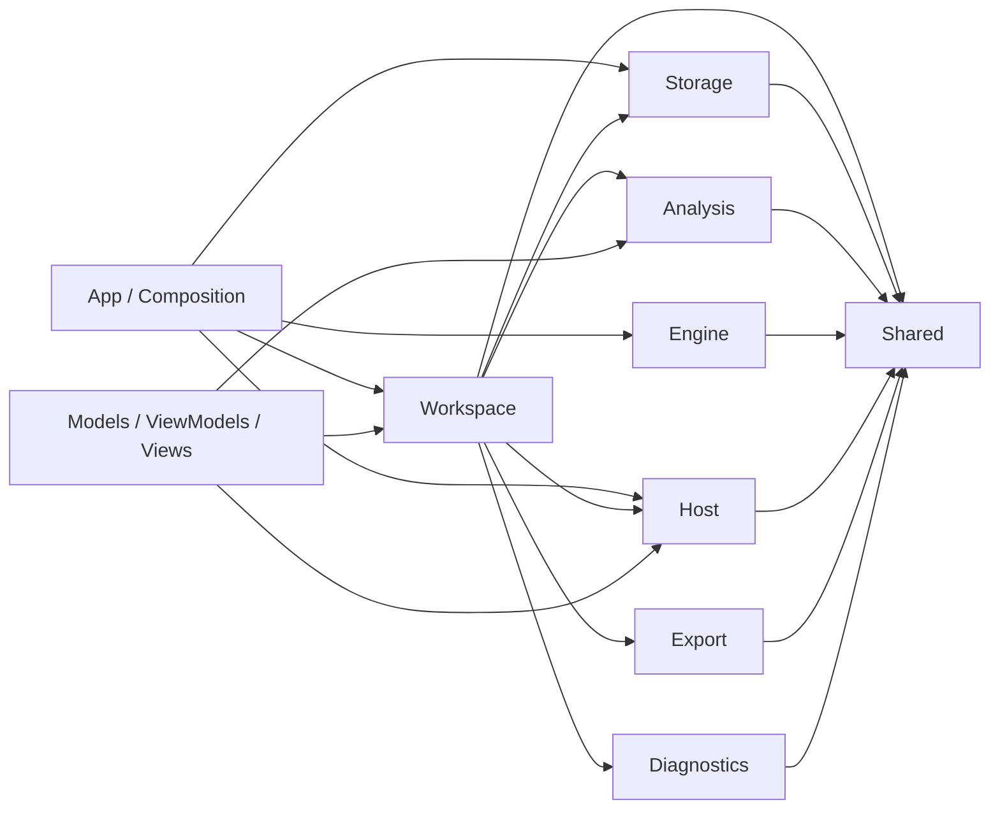
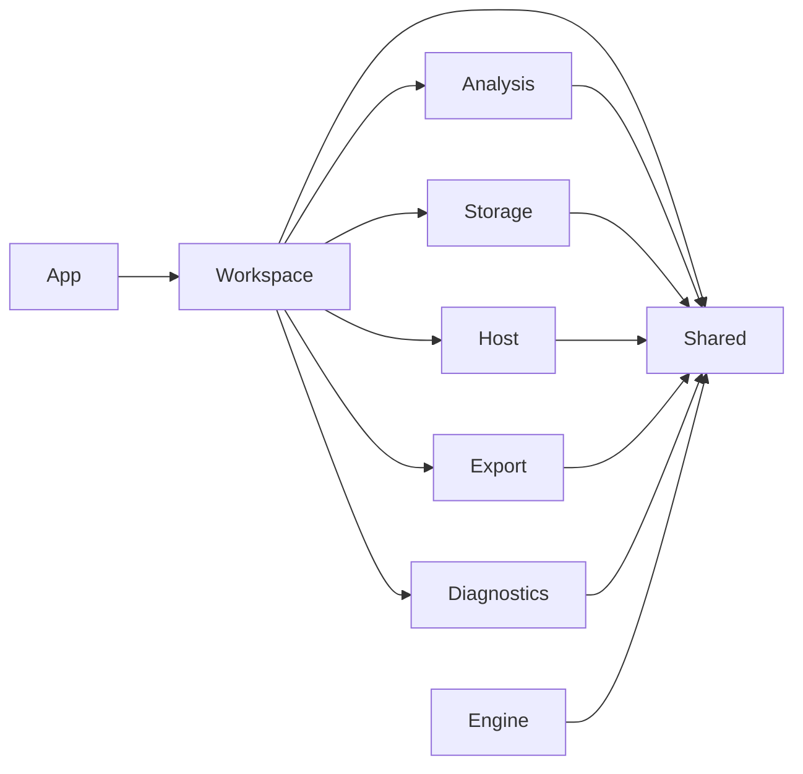

# WordZMac Architecture Baseline (Phase 0)

Date: 2026-04-08  
Scope: 1.3.0 structural consolidation baseline  
Rule set: no algorithm changes, no persistence format changes, no destructive migration

## 1. Current module map

This is the current logical module shape, based on the actual source tree rather than the old flat layout.

| Logical module | Current directories | Swift file count | Current role |
| --- | --- | ---: | --- |
| App | `App/` | 11 | app entry, menus, composition root |
| Workspace | `Workspace/` | 86 | coordinators, repository orchestration, scene graph, shell state |
| Analysis | `Analysis/` | 59 | scene builders, analysis services, filters, state protocols |
| Engine | `Engine/` | 18 | local engine RPC transport, contracts, engine-side support |
| Storage | `Storage/` | 24 | corpus persistence, workspace snapshot persistence, db/file storage |
| Host | `Host/` | 14 | dialogs, quick look, sharing, update host actions, window integration |
| Export | `Export/` | 11 | CSV/XLSX/TXT/report export services |
| Diagnostics | `Diagnostics/` | 5 | diagnostics bundle writing, redaction, archive assembly |
| Shared | `Shared/` | 3 | small cross-domain support helpers |
| Presentation residue | `Models/`, `ViewModels/`, `Views/{Workspace,Workbench,Windows}` | 198 | still acts as a cross-cutting holding zone, but `Views` now has explicit workspace/workbench/window buckets |

## 2. Structural reading of the current system

Representative current entry points:

- App composition root: [NativeAppContainer.swift](/Users/zouyuxuan/corpus-lite/apps/macos-native/WordZMac/Sources/WordZMac/App/Composition/NativeAppContainer.swift)
- Runtime dependency assembly: [MainWorkspaceRuntimeDependencies.swift](/Users/zouyuxuan/corpus-lite/apps/macos-native/WordZMac/Sources/WordZMac/ViewModels/MainWorkspaceRuntimeDependencies.swift)
- Coordinator assembly: [WorkspaceCoordinatorFactory.swift](/Users/zouyuxuan/corpus-lite/apps/macos-native/WordZMac/Sources/WordZMac/Workspace/Services/WorkspaceCoordinatorFactory.swift)
- Main app repository contract: [WorkspaceRepository.swift](/Users/zouyuxuan/corpus-lite/apps/macos-native/WordZMac/Sources/WordZMac/Workspace/Protocols/WorkspaceRepository.swift)

What is already good:

- App composition has started to split cleanly into `App / Workspace / Storage / Engine`.
- `WorkspaceActionDispatcher`, `WorkspaceFlowCoordinator`, `WorkspaceSceneGraphStore`, and `MainWorkspaceViewModel` have already begun extension-based separation.
- `Storage/Workspace` and `Storage/Library` have started to separate persistence concerns from orchestration concerns.

What is still structurally expensive:

- `Models / ViewModels / Views` remain very large holding areas and still cut across almost every logical domain.
- `Workspace` is still the heaviest module and currently absorbs orchestration, coordination, and repository composition.
- Presentation and orchestration are cleaner than before, but not yet fully normalized around the target module boundaries.

## 3. Current dependency direction

Current practical dependency picture:



The main structural problem is not a single illegal edge; it is that `Presentation` is still too central and still reaches into multiple logical domains.

## 4. Target dependency direction for phase 1

This is the boundary rule to freeze next:



Boundary rules:

1. `App` only composes and routes.
2. `Workspace` owns workflow orchestration and scene/state coordination.
3. `Analysis` owns result construction and lexical/statistical domain logic.
4. `Storage` owns corpus/workspace persistence and migrations.
5. `Host` owns macOS-facing capabilities only.
6. `Export` owns serializing user-visible outputs only.
7. `Diagnostics` owns bundle/report generation only.
8. `Shared` must stay small and dependency-light.
9. `Models / ViewModels / Views` are temporary holding zones and must stop growing without an explicit target module mapping.

## 5. Recompilation hotspot map

The following files are the current size-based and churn-risk hotspots. They are the most likely to keep slowing down future refactors and broad rebuilds.

| Lines | File |
| ---: | --- |
| 310 | [TopicsView+Results.swift](/Users/zouyuxuan/corpus-lite/apps/macos-native/WordZMac/Sources/WordZMac/Views/Workspace/Pages/TopicsView+Results.swift) |
| 304 | [LibraryManagementView+Panes.swift](/Users/zouyuxuan/corpus-lite/apps/macos-native/WordZMac/Sources/WordZMac/Views/Windows/LibraryManagementView+Panes.swift) |
| 299 | [CollocateSceneModel.swift](/Users/zouyuxuan/corpus-lite/apps/macos-native/WordZMac/Sources/WordZMac/Models/Scene/CollocateSceneModel.swift) |
| 298 | [KeywordSceneBuilder.swift](/Users/zouyuxuan/corpus-lite/apps/macos-native/WordZMac/Sources/WordZMac/Analysis/Builders/KeywordSceneBuilder.swift) |
| 297 | [SidebarView+Sections.swift](/Users/zouyuxuan/corpus-lite/apps/macos-native/WordZMac/Sources/WordZMac/Views/Workspace/SidebarView+Sections.swift) |
| 291 | [NativeAnalysisEngine+DocumentSupport.swift](/Users/zouyuxuan/corpus-lite/apps/macos-native/WordZMac/Sources/WordZMac/Analysis/Services/NativeAnalysisEngine+DocumentSupport.swift) |
| 290 | [NativePersistedWorkspaceSnapshot.swift](/Users/zouyuxuan/corpus-lite/apps/macos-native/WordZMac/Sources/WordZMac/Storage/Workspace/NativePersistedWorkspaceSnapshot.swift) |
| 289 | [CollocateSceneBuilder.swift](/Users/zouyuxuan/corpus-lite/apps/macos-native/WordZMac/Sources/WordZMac/Analysis/Builders/CollocateSceneBuilder.swift) |
| 288 | [WordZMacCommands.swift](/Users/zouyuxuan/corpus-lite/apps/macos-native/WordZMac/Sources/WordZMac/App/WordZMacCommands.swift) |
| 284 | [KeywordAnalysisSupport.swift](/Users/zouyuxuan/corpus-lite/apps/macos-native/WordZMac/Sources/WordZMac/Analysis/Support/KeywordAnalysisSupport.swift) |
| 278 | [NativeWorkspaceRepository+StoreOperations.swift](/Users/zouyuxuan/corpus-lite/apps/macos-native/WordZMac/Sources/WordZMac/Workspace/Services/NativeWorkspaceRepository+StoreOperations.swift) |
| 273 | [TokenizeView.swift](/Users/zouyuxuan/corpus-lite/apps/macos-native/WordZMac/Sources/WordZMac/Views/Workspace/Pages/TokenizeView.swift) |

Interpretation:

- The biggest remaining hotspots are not the coordinators anymore; they are now page views, scene models, builders, and storage snapshot models.
- This means phase 1 should prioritize boundary rules and directory discipline, not another round of mechanical method extraction.

## 6. Must-converge areas

These areas must be actively constrained in phase 1:

1. Keep the legacy `Sources/WordZMac/Services` placeholder removed; new production code must land in a real domain directory instead.
2. Stop adding new root-level files to `Models` and `Views`, and keep `ViewModels` root-level families constrained to the existing presentation types.
3. Keep `WorkspaceRepository` as the stable contract for callers.
4. Keep `NativeAppContainer` and `WorkspaceCoordinatorFactory` as assembly-only, not business-decision holders.
5. Keep `Dispatcher -> ViewModel mutation -> SceneGraph sync -> Root scene apply` as the only presentation update chain.

## 7. Areas to leave untouched in phase 1

These are intentionally not phase-1 rewrite targets:

- analysis algorithms in `Analysis/Services/NativeAnalysisEngine*`
- persisted workspace schema in `Storage/Workspace/NativePersistedWorkspaceSnapshot.swift`
- corpus storage format and db migration behavior in `Storage/Library/*`
- export file semantics in `Export/Services/*`

Reason:

- changing these would mix structural cleanup with behavior risk
- phase 0 must preserve result semantics and stored data compatibility

## 8. Phase 1 entry points

Phase 1 should do exactly these things first:

1. Freeze the target boundary rule above in code review guidance and the architecture guard.
2. Decide the destination strategy for `Models / ViewModels / Views`:
   either keep them as presentation-only zones with no domain leakage, or start moving them under module-owned subfolders.
3. Normalize `Workspace` as orchestration-only and prevent new storage/host/export logic from being added there directly.
4. Add one architecture regression check for forbidden legacy growth:
   - `Sources/WordZMac/Services` stays removed
   - no new root-level files in `Models`
   - no new root-level Swift files in `Views`, and only `Workspace`, `Workbench`, `Windows` remain as first-level view directories
   - no new root-level type families in `ViewModels`
   - `Analysis` must not reference workspace shell, scene graph, or host UI services
   - `Storage` must not reference workspace shell or host UI services

## 9. Phase 1 rule freeze

The architecture guard now enforces the following baseline rules:

1. `Sources/WordZMac/Services` must stay removed.
2. `Models` must remain organized under subfolders only.
3. `ViewModels` root-level files may only belong to these existing families:
   `ChiSquarePageViewModel`, `CollocatePageViewModel`, `ComparePageViewModel`, `KWICPageViewModel`, `KeywordPageViewModel`, `LibraryManagementViewModel`, `LibrarySidebarViewModel`, `LocatorPageViewModel`, `MainWorkspaceRuntimeDependencies`, `MainWorkspaceViewModel`, `NgramPageViewModel`, `SceneSyncSource`, `StatsPageViewModel`, `TokenizePageViewModel`, `TopicsPageViewModel`, `WordPageViewModel`, `WorkspaceSettingsViewModel`, `WorkspaceShellViewModel`.
4. `Views` must not contain root-level Swift files, and its first-level directories are frozen to:
   `Workspace`, `Workbench`, `Windows`.
5. `Analysis` may not reference `MainWorkspaceViewModel`, `WorkspaceFlowCoordinator`, `WorkspaceActionDispatcher`, `RootContentView`, `NativeWorkspaceRepository`, `NativeHostActionService`, `NativeDialogServicing`, `QuickLookPreviewFileService`, `WorkspaceSceneStore`, `WorkspaceSceneGraphStore`, or `WorkspaceShellViewModel`.
6. `Storage` may not reference `MainWorkspaceViewModel`, `WorkspaceFlowCoordinator`, `WorkspaceActionDispatcher`, `RootContentView`, `NativeHostActionService`, `NativeDialogServicing`, `QuickLookPreviewFileService`, `WorkspaceSceneStore`, `WorkspaceSceneGraphStore`, or `WorkspaceShellViewModel`.

## 10. Phase 0 acceptance

Phase 0 is considered complete when:

- the module map is explicit
- the target dependency direction is explicit
- hotspot files are named
- “must converge” vs “leave untouched” zones are explicit
- the workspace still builds and tests green after the structural tidy-up

## 11. Phase 2 structural status

Phase 2 is now partially completed and has already moved the app onto a cleaner composition model.

What is now true:

1. `NativeAppContainer` builds the live app path through `App/Composition`, rather than relying on `MainWorkspaceViewModel` to resolve runtime collaborators by itself.
2. `MainWorkspaceViewModel` has a pure core initializer that consumes `MainWorkspaceRuntimeDependencies` as already-built collaborators.
3. `WorkspaceFlowCoordinator` now exposes only its core initializer, so collaborator assembly stays outside the coordinator itself.
4. `LibraryCoordinator`, `LibraryManagementCoordinator`, `WorkspaceExportCoordinator`, `QuickLookPreviewFileService`, `RootContentSceneBuilder`, and `WorkspaceResultSceneNodeBuilder` now sit behind protocol boundaries for callers.
5. Composition behavior is now locked by dedicated tests in [CompositionTests.swift](/Users/zouyuxuan/corpus-lite/apps/macos-native/WordZMac/Tests/WordZMacTests/CompositionTests.swift).
6. Test-only construction now lives in dedicated helpers under [TestSupport.swift](/Users/zouyuxuan/corpus-lite/apps/macos-native/WordZMac/Tests/WordZMacTests/TestSupport.swift), rather than in production convenience initializers.

What is intentionally still transitional:

1. Direct factory injection remains available in test paths through `MainWorkspaceRuntimeDependencyBuilding` and `WorkspaceCoordinatorBuilding`.
2. Some protocol seams are still intentionally broader than the live app path so tests can assemble focused collaborators without reintroducing production-only convenience constructors.

## 12. Phase 2 guard additions

The architecture guard now also freezes these composition rules:

1. `App/Composition` must remain free of `SwiftUI` and `AppKit` imports.
2. Concrete composition-root types must stay inside `App`:
   `NativeAppContainer`, `NativeAppLiveComposition`, `HostDomainFactory`, `ExportDomainFactory`, `WorkspaceDomainFactory`, `StorageDomainFactory`, `EngineDomainFactory`, `DiagnosticsDomainFactory`.
3. The app path should treat `App/Composition` as assembly-only and not as a second workflow layer.

These guard rules are intentionally narrower than a full “composition purity” rewrite. The goal is to prevent new leakage while keeping the remaining test seams stable.

## 13. Phase 2 next entry points

The best next structural steps are now:

1. Keep test assembly concentrated in dedicated helpers rather than widening production constructors again.
2. Add one more guard for “no workflow mutation in composition root”.
3. Revisit whether any remaining protocol seams can narrow further once the current test helpers stop needing them.

## 14. Phase 5 guardrail status

Phase 5 now freezes the structural cleanup work into executable guardrails.

What is now true:

1. `Scripts/engineering-guard.sh` provides a single fast gate for architecture and state-flow regressions.
2. `Scripts/architecture-guard.sh` now also enforces that `App/Composition` remains assembly-only and does not directly mutate workflow state.
3. `RootContent` and scene-sync regressions are protected by focused suites:
   - [SceneSyncPlanTests.swift](/Users/zouyuxuan/corpus-lite/apps/macos-native/WordZMac/Tests/WordZMacTests/SceneSyncPlanTests.swift)
   - [RootContentSceneTests.swift](/Users/zouyuxuan/corpus-lite/apps/macos-native/WordZMac/Tests/WordZMacTests/RootContentSceneTests.swift)
   - [MainWorkspaceViewModelTests.swift](/Users/zouyuxuan/corpus-lite/apps/macos-native/WordZMac/Tests/WordZMacTests/MainWorkspaceViewModelTests.swift)
4. A lightweight no-op sync performance baseline now exists in [EngineeringGuardrailTests.swift](/Users/zouyuxuan/corpus-lite/apps/macos-native/WordZMac/Tests/WordZMacTests/EngineeringGuardrailTests.swift).

What this phase is intentionally not:

1. It is not a full benchmark harness.
2. It does not replace full `swift test`.
3. It does not freeze algorithmic performance or storage migration timing.

## 15. Phase 5 working rule

Before landing structural refactors or shell/state-flow changes, the minimum expected gate is now:

```bash
zsh Scripts/engineering-guard.sh
```

Before release and before wide-reaching refactors, run:

```bash
zsh Scripts/engineering-guard.sh
swift test --package-path .
```
