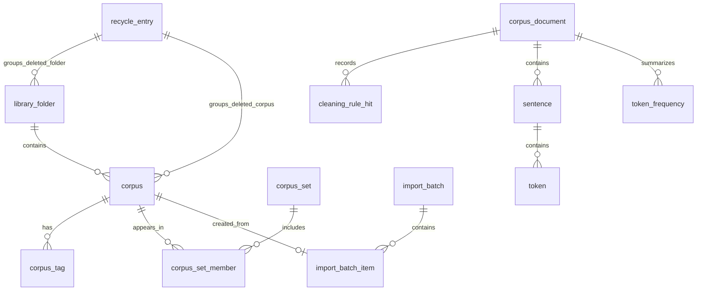

# WordZ 语料库管理数据库模式设计

## 1. 设计目标

这份 schema 只覆盖 **语料库管理域**，也就是：

- 文件夹 / 语料 / 元数据
- 命名语料集
- 回收站
- 导入与修复所需的目录级信息
- 单语料正文、句子、token、词频与检索索引

它 **不覆盖** 工作区快照、分析预设、证据工作台、命中集、情感 review sample 等工作区域对象；那些更适合放在相邻的 `workspace.db` 或独立持久化模块里。

## 2. 物理布局

当前实现采用三层存储：

1. `library.db`
   负责“目录级”对象，支持列表、筛选、回收站、命名语料集、导入批次、quarantine 与快速统计。
2. `workspace.db`
   负责工作区快照、UI 设置、分析预设、命中集、证据项与情感 review sample。
3. `corpora/<corpus_id>.db`
   每条语料一个分片库，负责正文、句子、token、词频与全文检索。

这样做有四个直接好处：

- 语料列表与元数据筛选不需要扫大文本。
- workspace 对象不再散落在 JSON 文件里，备份和恢复都可以按数据库语义处理。
- 单个损坏语料可以隔离、修复或回收，不会拖垮整库。
- 继续贴合 WordZ 当前“每个语料单独 `.db` 文件”的演进方向，并把目录级持久化完全收口进中心库。

## 3. 关系概览



## 4. 中心目录库：`library.db`

### 4.1 `schema_migrations`

用途：记录 schema 版本与迁移历史。

| 列 | 类型 | 约束 | 说明 |
| --- | --- | --- | --- |
| `version` | `INTEGER` | `PRIMARY KEY` | 单调递增版本号 |
| `applied_at` | `TEXT` | `NOT NULL` | ISO-8601 时间 |
| `description` | `TEXT` | `NOT NULL` | 迁移摘要 |

索引：

- 主键即可，无额外索引。

### 4.2 `library_folder`

用途：语料库中的逻辑文件夹。当前 UI 是平面文件夹，但 schema 保留 `parent_folder_id`，以后要做层级文件夹时不用重写表。

| 列 | 类型 | 约束 | 说明 |
| --- | --- | --- | --- |
| `id` | `TEXT` | `PRIMARY KEY` | UUID |
| `parent_folder_id` | `TEXT` | `NULL REFERENCES library_folder(id) ON DELETE RESTRICT` | 允许未来扩展成树形目录 |
| `name` | `TEXT` | `NOT NULL` | 文件夹名 |
| `sort_order` | `INTEGER` | `NOT NULL DEFAULT 0` | UI 排序 |
| `recycle_entry_id` | `TEXT` | `NULL REFERENCES recycle_entry(id)` | 被删除时挂到回收条目 |
| `deleted_at` | `TEXT` | `NULL` | 软删除时间 |
| `created_at` | `TEXT` | `NOT NULL` | 创建时间 |
| `updated_at` | `TEXT` | `NOT NULL` | 修改时间 |

索引：

- `CREATE INDEX idx_folder_parent_sort ON library_folder(parent_folder_id, sort_order, name COLLATE NOCASE);`
- `CREATE INDEX idx_folder_recycle_entry ON library_folder(recycle_entry_id);`
- `CREATE UNIQUE INDEX uq_folder_name_active ON library_folder(COALESCE(parent_folder_id, ''), name COLLATE NOCASE) WHERE deleted_at IS NULL;`

### 4.3 `corpus`

用途：语料目录主表，存放列表页与筛选页的“热字段”，避免每次打开语料都去读分片库。

| 列 | 类型 | 约束 | 说明 |
| --- | --- | --- | --- |
| `id` | `TEXT` | `PRIMARY KEY` | UUID |
| `folder_id` | `TEXT` | `NULL REFERENCES library_folder(id) ON DELETE SET NULL` | 所属文件夹 |
| `name` | `TEXT` | `NOT NULL` | 语料显示名 |
| `source_type` | `TEXT` | `NOT NULL` | `txt/pdf/docx/...` 或导入来源类型 |
| `represented_path` | `TEXT` | `NOT NULL` | 原始文件路径 |
| `storage_uri` | `TEXT` | `NOT NULL` | 例如 `corpora/<id>.db` |
| `storage_format` | `TEXT` | `NOT NULL DEFAULT 'sqlite-shard'` | 便于以后扩展别的存储格式 |
| `storage_status` | `TEXT` | `NOT NULL DEFAULT 'available' CHECK (storage_status IN ('available', 'missing', 'quarantined', 'recycled'))` | 文件存在性与修复状态 |
| `detected_encoding` | `TEXT` | `NOT NULL DEFAULT ''` | 导入时识别到的编码 |
| `imported_at` | `TEXT` | `NOT NULL` | 导入完成时间 |
| `source_label` | `TEXT` | `NOT NULL DEFAULT ''` | 元数据：来源 |
| `genre_label` | `TEXT` | `NOT NULL DEFAULT ''` | 元数据：体裁 |
| `year_display` | `TEXT` | `NOT NULL DEFAULT ''` | 原始年份展示值，例如 `Late 1990s` |
| `year_start` | `INTEGER` | `NULL CHECK (year_start IS NULL OR year_start BETWEEN 0 AND 9999)` | 规范化年份下界 |
| `year_end` | `INTEGER` | `NULL CHECK (year_end IS NULL OR year_end BETWEEN 0 AND 9999)` | 规范化年份上界 |
| `extra_metadata_json` | `TEXT` | `NOT NULL DEFAULT '{}' CHECK (json_valid(extra_metadata_json))` | 长尾元数据扩展位 |
| `token_count` | `INTEGER` | `NOT NULL DEFAULT 0` | 统计摘要 |
| `type_count` | `INTEGER` | `NOT NULL DEFAULT 0` | 统计摘要 |
| `sentence_count` | `INTEGER` | `NOT NULL DEFAULT 0` | 统计摘要 |
| `paragraph_count` | `INTEGER` | `NOT NULL DEFAULT 0` | 统计摘要 |
| `character_count` | `INTEGER` | `NOT NULL DEFAULT 0` | 统计摘要 |
| `ttr` | `REAL` | `NOT NULL DEFAULT 0` | Type-token ratio |
| `sttr` | `REAL` | `NOT NULL DEFAULT 0` | Standardized TTR |
| `cleaning_status` | `TEXT` | `NOT NULL DEFAULT 'pending' CHECK (cleaning_status IN ('pending', 'cleaned', 'cleaned_with_changes'))` | 清洗状态 |
| `cleaning_profile_version` | `TEXT` | `NOT NULL DEFAULT ''` | 清洗规则版本 |
| `cleaned_at` | `TEXT` | `NULL` | 清洗时间 |
| `original_character_count` | `INTEGER` | `NOT NULL DEFAULT 0` | 清洗前字符数 |
| `cleaned_character_count` | `INTEGER` | `NOT NULL DEFAULT 0` | 清洗后字符数 |
| `cleaned_text_digest` | `TEXT` | `NOT NULL DEFAULT ''` | 清洗后正文摘要 |
| `checksum_sha256` | `TEXT` | `NOT NULL DEFAULT ''` | 分片文件完整性校验 |
| `recycle_entry_id` | `TEXT` | `NULL REFERENCES recycle_entry(id)` | 进入回收站时绑定 |
| `deleted_at` | `TEXT` | `NULL` | 软删除时间 |
| `created_at` | `TEXT` | `NOT NULL` | 记录创建时间 |
| `updated_at` | `TEXT` | `NOT NULL` | 最近修改时间 |

索引：

- `CREATE INDEX idx_corpus_folder_active ON corpus(folder_id, name COLLATE NOCASE) WHERE deleted_at IS NULL;`
- `CREATE INDEX idx_corpus_imported_at ON corpus(imported_at DESC) WHERE deleted_at IS NULL;`
- `CREATE INDEX idx_corpus_represented_path ON corpus(represented_path);`
- `CREATE INDEX idx_corpus_source_label ON corpus(source_label COLLATE NOCASE) WHERE deleted_at IS NULL;`
- `CREATE INDEX idx_corpus_genre_label ON corpus(genre_label COLLATE NOCASE) WHERE deleted_at IS NULL;`
- `CREATE INDEX idx_corpus_year_range ON corpus(year_start, year_end) WHERE deleted_at IS NULL;`
- `CREATE INDEX idx_corpus_cleaning_status ON corpus(cleaning_status) WHERE deleted_at IS NULL;`
- `CREATE INDEX idx_corpus_storage_status ON corpus(storage_status);`
- `CREATE INDEX idx_corpus_recycle_entry ON corpus(recycle_entry_id);`

说明：

- `source_label / genre_label / year_*` 放成显式列，因为它们是高频筛选项。
- `extra_metadata_json` 只承接长尾字段，避免为每个实验字段都加一张 EAV 表。
- 统计摘要冗余在目录表中，是为了让库窗口、信息面板、完整性提示直接查询，不必打开 `corpora/<id>.db`。

### 4.4 `corpus_tag`

用途：标签归一化存储。相比把标签拼成 `tags_text`，这张表更适合精确过滤、批量维护和索引。

| 列 | 类型 | 约束 | 说明 |
| --- | --- | --- | --- |
| `corpus_id` | `TEXT` | `NOT NULL REFERENCES corpus(id) ON DELETE CASCADE` | 语料 ID |
| `tag` | `TEXT` | `NOT NULL` | 用户展示值 |
| `normalized_tag` | `TEXT` | `NOT NULL` | 统一小写 / 去重音后的检索值 |
| `created_at` | `TEXT` | `NOT NULL` | 添加时间 |

主键与索引：

- `PRIMARY KEY (corpus_id, normalized_tag)`
- `CREATE INDEX idx_corpus_tag_lookup ON corpus_tag(normalized_tag, corpus_id);`

### 4.5 `corpus_set`

用途：命名语料集。既保存成员，也保存保存时的 metadata filter 快照，保证“语料成员”和“当时的筛选语义”都能恢复。

| 列 | 类型 | 约束 | 说明 |
| --- | --- | --- | --- |
| `id` | `TEXT` | `PRIMARY KEY` | UUID |
| `name` | `TEXT` | `NOT NULL` | 集合名 |
| `metadata_filter_json` | `TEXT` | `NOT NULL DEFAULT '{}' CHECK (json_valid(metadata_filter_json))` | 保存时的 filter state |
| `notes` | `TEXT` | `NOT NULL DEFAULT ''` | 可选说明 |
| `created_at` | `TEXT` | `NOT NULL` | 创建时间 |
| `updated_at` | `TEXT` | `NOT NULL` | 最近更新时间 |
| `deleted_at` | `TEXT` | `NULL` | 如果未来要支持回收语料集，可直接启用 |

索引：

- `CREATE UNIQUE INDEX uq_corpus_set_name_active ON corpus_set(name COLLATE NOCASE) WHERE deleted_at IS NULL;`
- `CREATE INDEX idx_corpus_set_updated_at ON corpus_set(updated_at DESC) WHERE deleted_at IS NULL;`

### 4.6 `corpus_set_member`

用途：语料集成员表。使用显式成员表而不是把 `corpus_ids` 塞进 JSON，便于 join、差集、排序和完整性约束。

| 列 | 类型 | 约束 | 说明 |
| --- | --- | --- | --- |
| `corpus_set_id` | `TEXT` | `NOT NULL REFERENCES corpus_set(id) ON DELETE CASCADE` | 语料集 ID |
| `corpus_id` | `TEXT` | `NOT NULL REFERENCES corpus(id) ON DELETE CASCADE` | 语料 ID |
| `position` | `INTEGER` | `NOT NULL DEFAULT 0` | 成员顺序 |
| `added_at` | `TEXT` | `NOT NULL` | 添加时间 |

主键与索引：

- `PRIMARY KEY (corpus_set_id, corpus_id)`
- `CREATE INDEX idx_corpus_set_member_position ON corpus_set_member(corpus_set_id, position, corpus_id);`
- `CREATE INDEX idx_corpus_set_member_corpus ON corpus_set_member(corpus_id, corpus_set_id);`

### 4.7 `recycle_entry`

用途：回收站条目。删除文件夹时，会创建一个“组条目”，同时把该文件夹及其语料都挂到这条记录上，这正好匹配 WordZ 当前回收站语义。

| 列 | 类型 | 约束 | 说明 |
| --- | --- | --- | --- |
| `id` | `TEXT` | `PRIMARY KEY` | UUID |
| `entry_type` | `TEXT` | `NOT NULL CHECK (entry_type IN ('corpus', 'folder', 'mixed'))` | 回收条目类型 |
| `display_name` | `TEXT` | `NOT NULL` | 列表显示名 |
| `original_folder_name` | `TEXT` | `NOT NULL DEFAULT ''` | 删除前所在文件夹名 |
| `item_count` | `INTEGER` | `NOT NULL DEFAULT 0` | 条目包含对象数 |
| `status` | `TEXT` | `NOT NULL DEFAULT 'active' CHECK (status IN ('active', 'restored', 'purged'))` | 回收条目状态 |
| `deleted_at` | `TEXT` | `NOT NULL` | 删除时间 |
| `restored_at` | `TEXT` | `NULL` | 恢复时间 |
| `purged_at` | `TEXT` | `NULL` | 彻底清除时间 |
| `note` | `TEXT` | `NOT NULL DEFAULT ''` | 维修/修复备注 |

索引：

- `CREATE INDEX idx_recycle_entry_deleted_at ON recycle_entry(deleted_at DESC);`
- `CREATE INDEX idx_recycle_entry_status ON recycle_entry(status, deleted_at DESC);`

说明：

- 不再单独建 `recycle_entry_item`，而是让 `library_folder.recycle_entry_id` 与 `corpus.recycle_entry_id` 直接指向回收条目。
- 这样恢复动作只需按 `recycle_entry_id` 批量清空 `deleted_at / recycle_entry_id` 即可。

### 4.8 `import_batch`

用途：记录一次导入操作，支持进度恢复、失败诊断与导入后统计。

| 列 | 类型 | 约束 | 说明 |
| --- | --- | --- | --- |
| `id` | `TEXT` | `PRIMARY KEY` | UUID |
| `source_kind` | `TEXT` | `NOT NULL CHECK (source_kind IN ('file', 'folder', 'restore', 'migration'))` | 导入来源 |
| `status` | `TEXT` | `NOT NULL CHECK (status IN ('running', 'completed', 'cancelled', 'failed'))` | 批次状态 |
| `requested_count` | `INTEGER` | `NOT NULL` | 请求导入对象数 |
| `imported_count` | `INTEGER` | `NOT NULL DEFAULT 0` | 成功导入数量 |
| `skipped_count` | `INTEGER` | `NOT NULL DEFAULT 0` | 跳过数量 |
| `failure_count` | `INTEGER` | `NOT NULL DEFAULT 0` | 失败数量 |
| `cleaned_count` | `INTEGER` | `NOT NULL DEFAULT 0` | 完成清洗数量 |
| `cleaning_changed_count` | `INTEGER` | `NOT NULL DEFAULT 0` | 清洗后有变更数量 |
| `summary_json` | `TEXT` | `NOT NULL DEFAULT '{}' CHECK (json_valid(summary_json))` | 汇总扩展字段 |
| `started_at` | `TEXT` | `NOT NULL` | 开始时间 |
| `finished_at` | `TEXT` | `NULL` | 结束时间 |

索引：

- `CREATE INDEX idx_import_batch_started_at ON import_batch(started_at DESC);`
- `CREATE INDEX idx_import_batch_status ON import_batch(status, started_at DESC);`

### 4.9 `import_batch_item`

用途：记录批次内每个文件的结果，便于导入报告、失败重试和清洗摘要回溯。

| 列 | 类型 | 约束 | 说明 |
| --- | --- | --- | --- |
| `id` | `TEXT` | `PRIMARY KEY` | UUID |
| `import_batch_id` | `TEXT` | `NOT NULL REFERENCES import_batch(id) ON DELETE CASCADE` | 所属批次 |
| `source_path` | `TEXT` | `NOT NULL` | 文件路径 |
| `file_name` | `TEXT` | `NOT NULL` | 文件名 |
| `target_folder_id` | `TEXT` | `NULL REFERENCES library_folder(id) ON DELETE SET NULL` | 目标文件夹 |
| `corpus_id` | `TEXT` | `NULL REFERENCES corpus(id) ON DELETE SET NULL` | 成功导入后关联的语料 |
| `result` | `TEXT` | `NOT NULL CHECK (result IN ('imported', 'skipped', 'failed'))` | 单项结果 |
| `failure_reason` | `TEXT` | `NOT NULL DEFAULT ''` | 失败原因 |
| `started_at` | `TEXT` | `NOT NULL` | 开始时间 |
| `finished_at` | `TEXT` | `NULL` | 结束时间 |

索引：

- `CREATE INDEX idx_import_batch_item_batch_result ON import_batch_item(import_batch_id, result, finished_at);`
- `CREATE INDEX idx_import_batch_item_corpus ON import_batch_item(corpus_id);`

### 4.10 `corpus_search_fts`

用途：库窗口自由检索。元数据筛选用 B-Tree，模糊全文式搜索用 FTS5。

当前实现采用 SQLite FTS5 虚表：

```sql
CREATE VIRTUAL TABLE corpus_search_fts USING fts5(
    corpus_id UNINDEXED,
    name,
    source_label,
    genre_label,
    year_display,
    tags,
    content=''
);
```

说明：

- `corpus_search_fts` 不替代 `corpus` 的普通索引。
- 它专门解决 `LIKE '%term%'` 这类无法利用普通索引的问题。
- 实际实现由目录写路径主动重建和刷新索引，不依赖数据库 trigger。

## 5. 单语料分片库：`corpora/<corpus_id>.db`

### 5.1 `corpus_document`

用途：单语料正文与统计总表。每个分片库只有一行，`id = 1`。

| 列 | 类型 | 约束 | 说明 |
| --- | --- | --- | --- |
| `id` | `INTEGER` | `PRIMARY KEY CHECK (id = 1)` | 固定主键 |
| `schema_version` | `INTEGER` | `NOT NULL` | 分片 schema 版本 |
| `corpus_id` | `TEXT` | `NOT NULL` | 与目录库中的 `corpus.id` 对应 |
| `imported_at` | `TEXT` | `NOT NULL` | 导入时间 |
| `source_type` | `TEXT` | `NOT NULL` | 源类型 |
| `represented_path` | `TEXT` | `NOT NULL` | 原始路径 |
| `detected_encoding` | `TEXT` | `NOT NULL` | 检测编码 |
| `source_label` | `TEXT` | `NOT NULL DEFAULT ''` | 元数据冗余，便于修复 |
| `genre_label` | `TEXT` | `NOT NULL DEFAULT ''` | 元数据冗余，便于修复 |
| `year_display` | `TEXT` | `NOT NULL DEFAULT ''` | 元数据冗余，便于修复 |
| `year_start` | `INTEGER` | `NULL CHECK (year_start IS NULL OR year_start BETWEEN 0 AND 9999)` | 规范化年份下界冗余 |
| `year_end` | `INTEGER` | `NULL CHECK (year_end IS NULL OR year_end BETWEEN 0 AND 9999)` | 规范化年份上界冗余 |
| `tags_json` | `TEXT` | `NOT NULL DEFAULT '[]' CHECK (json_valid(tags_json))` | 标签冗余 |
| `extra_metadata_json` | `TEXT` | `NOT NULL DEFAULT '{}' CHECK (json_valid(extra_metadata_json))` | 扩展元数据冗余 |
| `token_count` | `INTEGER` | `NOT NULL` | 总 token 数 |
| `type_count` | `INTEGER` | `NOT NULL` | 总 type 数 |
| `sentence_count` | `INTEGER` | `NOT NULL` | 句子数 |
| `paragraph_count` | `INTEGER` | `NOT NULL` | 段落数 |
| `character_count` | `INTEGER` | `NOT NULL` | 字符数 |
| `ttr` | `REAL` | `NOT NULL` | TTR |
| `sttr` | `REAL` | `NOT NULL` | STTR |
| `cleaned_at` | `TEXT` | `NULL` | 清洗时间 |
| `cleaning_profile_version` | `TEXT` | `NOT NULL DEFAULT ''` | 清洗版本 |
| `original_character_count` | `INTEGER` | `NOT NULL DEFAULT 0` | 清洗前字符数 |
| `cleaned_character_count` | `INTEGER` | `NOT NULL DEFAULT 0` | 清洗后字符数 |
| `cleaned_text_digest` | `TEXT` | `NOT NULL` | 清洗正文摘要 |
| `raw_text` | `TEXT` | `NOT NULL` | 原始正文 |
| `cleaned_text` | `TEXT` | `NOT NULL` | 清洗后正文 |

索引：

- `CREATE INDEX idx_corpus_document_imported_at ON corpus_document(imported_at DESC);`
- `CREATE INDEX idx_corpus_document_represented_path ON corpus_document(represented_path);`

说明：

- 目录库和分片库都存一份轻量 metadata，是有意冗余。
- 这样做可以在 `repair` 时用分片库反推目录元数据，也能让单个分片具备“自描述性”。

### 5.2 `cleaning_rule_hit`

用途：记录一次清洗命中了哪些规则，比把整个数组塞进 JSON 更利于统计与后续聚合。

| 列 | 类型 | 约束 | 说明 |
| --- | --- | --- | --- |
| `document_id` | `INTEGER` | `NOT NULL REFERENCES corpus_document(id) ON DELETE CASCADE` | 固定为 `1` |
| `rule_id` | `TEXT` | `NOT NULL` | 规则 ID |
| `hit_count` | `INTEGER` | `NOT NULL` | 命中次数 |

主键与索引：

- `PRIMARY KEY (document_id, rule_id)`
- `CREATE INDEX idx_cleaning_rule_hit_rule ON cleaning_rule_hit(rule_id, hit_count DESC);`

### 5.3 `sentence`

用途：句子级边界与文本。KWIC、Source Reader、证据定位都依赖它。

| 列 | 类型 | 约束 | 说明 |
| --- | --- | --- | --- |
| `id` | `INTEGER` | `PRIMARY KEY` | 句子 ID，建议从 `0` 连续编号 |
| `paragraph_index` | `INTEGER` | `NOT NULL` | 所在段落序号 |
| `sentence_index` | `INTEGER` | `NOT NULL` | 句序号 |
| `char_start` | `INTEGER` | `NOT NULL` | 起始字符偏移 |
| `char_end` | `INTEGER` | `NOT NULL` | 结束字符偏移 |
| `text` | `TEXT` | `NOT NULL` | 句子全文 |

索引：

- `CREATE UNIQUE INDEX uq_sentence_index ON sentence(sentence_index);`
- `CREATE INDEX idx_sentence_paragraph ON sentence(paragraph_index, sentence_index);`
- `CREATE INDEX idx_sentence_char_range ON sentence(char_start, char_end);`

### 5.4 `token`

用途：token 级索引，是 `token_position` 的泛化版。后续 `lemma / lexical class / script` 都应该在这张表落地，而不是继续塞 JSON。

| 列 | 类型 | 约束 | 说明 |
| --- | --- | --- | --- |
| `sentence_id` | `INTEGER` | `NOT NULL REFERENCES sentence(id) ON DELETE CASCADE` | 所属句子 |
| `token_index` | `INTEGER` | `NOT NULL` | 句内序号 |
| `document_token_index` | `INTEGER` | `NOT NULL` | 全文序号 |
| `surface` | `TEXT` | `NOT NULL` | 原始 token |
| `normalized` | `TEXT` | `NOT NULL` | 规范化 token |
| `lemma` | `TEXT` | `NULL` | 词元 |
| `lexical_class` | `TEXT` | `NOT NULL DEFAULT ''` | 词类 |
| `script` | `TEXT` | `NOT NULL DEFAULT ''` | 脚本类别 |
| `char_start` | `INTEGER` | `NOT NULL` | 字符起点 |
| `char_end` | `INTEGER` | `NOT NULL` | 字符终点 |

主键与索引：

- `PRIMARY KEY (sentence_id, token_index)`
- `CREATE UNIQUE INDEX uq_token_document_order ON token(document_token_index);`
- `CREATE INDEX idx_token_surface ON token(surface, document_token_index);`
- `CREATE INDEX idx_token_normalized ON token(normalized, document_token_index);`
- `CREATE INDEX idx_token_lemma ON token(lemma, document_token_index) WHERE lemma IS NOT NULL;`
- `CREATE INDEX idx_token_lexical_class ON token(lexical_class, normalized, document_token_index);`
- `CREATE INDEX idx_token_script ON token(script, normalized, document_token_index);`

### 5.5 `token_frequency`

用途：保存预聚合词频，避免每次打开统计页都从 token 重算。

| 列 | 类型 | 约束 | 说明 |
| --- | --- | --- | --- |
| `dimension` | `TEXT` | `NOT NULL CHECK (dimension IN ('surface', 'normalized', 'lemma'))` | 统计维度 |
| `term` | `TEXT` | `NOT NULL` | 词项 |
| `lexical_class` | `TEXT` | `NOT NULL DEFAULT ''` | 如需按词类切片，可直接命中 |
| `token_count` | `INTEGER` | `NOT NULL` | 词频 |
| `rank_index` | `INTEGER` | `NOT NULL` | 排名 |
| `norm_frequency` | `REAL` | `NOT NULL` | 规范化频率 |
| `sentence_range` | `INTEGER` | `NOT NULL` | 出现句数 |
| `paragraph_range` | `INTEGER` | `NOT NULL` | 出现段数 |

主键与索引：

- `PRIMARY KEY (dimension, term, lexical_class)`
- `CREATE INDEX idx_token_frequency_rank ON token_frequency(dimension, lexical_class, rank_index, term);`
- `CREATE INDEX idx_token_frequency_count ON token_frequency(dimension, lexical_class, token_count DESC, term);`
- `CREATE INDEX idx_token_frequency_norm ON token_frequency(dimension, lexical_class, norm_frequency DESC, term);`

说明：

- 把 `dimension` 显式化，比只存一份 `normalized` 词频更稳，因为 `1.4.x` 已经明确要把 `surface / lemma / lexical class` 变成一等视角。

### 5.6 `sentence_fts`

用途：全文检索与上下文召回。

当前实现采用 SQLite FTS5 虚表：

```sql
CREATE VIRTUAL TABLE sentence_fts USING fts5(
    text,
    content='sentence',
    content_rowid='id',
    tokenize='unicode61'
);
```

说明：

- `KWIC / Locator / Source Reader` 的文本检索走 `sentence_fts`。
- token 精准定位走 `token` 索引。
- 两条路径分别优化，不互相替代。

## 6. 关键关系与约束

### 6.1 关系

- 一个 `library_folder` 下有多条 `corpus`。
- 一条 `corpus` 有多条 `corpus_tag`。
- `corpus_set` 与 `corpus` 是多对多，通过 `corpus_set_member` 关联。
- 一个 `recycle_entry` 可以关联多条被删 `corpus`，也可以关联一条被删 `library_folder`。
- 一条 `corpus` 对应一个分片库；分片库中只有一条 `corpus_document`。
- 一条 `corpus_document` 有多条 `sentence`、`token_frequency` 和 `cleaning_rule_hit`。
- 一条 `sentence` 有多条 `token`。

### 6.2 删除策略

- 目录对象统一使用软删除：`deleted_at` + `recycle_entry_id`。
- 真正 purge 时，再物理删除目录行与分片文件。
- `corpus_set_member`、`corpus_tag` 使用硬删除级联即可，因为它们从属于 `corpus` / `corpus_set`。

### 6.3 时间与主键规范

- 所有时间列统一用 `TEXT` 存 ISO-8601 UTC 时间，便于 SQLite、Swift 与 JSON 互通。
- 业务主键统一用 `TEXT` UUID；分片库里的 `sentence.id` / `document_token_index` 允许使用整数顺序键，便于 range query。

## 7. 为什么这样设计

### 7.1 中心目录库和单语料分片分开

这是最重要的决策。

- 目录查询天然是“小而频繁”的：列列表、按 metadata 过滤、切文件夹、看回收站。
- 正文分析天然是“大而局部”的：打开一个语料、做 KWIC、读 token 位置。
- 把两者放在一张超大表里，会让库管理和正文分析互相拖累。

### 7.2 热字段显式列，冷字段 JSON

`source / year / genre / tags` 是产品已经固定下来的高频操作：

- metadata 筛选
- 完整性提示
- 批量编辑
- 语料集保存与恢复

所以它们必须是显式列或显式关联表。  
但如果未来加课程编号、采集批次、地区、作者等长尾字段，继续加列会让 schema 膨胀，因此保留 `extra_metadata_json` 作为扩展位。

### 7.3 `year_display` 与 `year_start/year_end` 双轨并存

只存字符串不利于范围筛选；只存整数又会丢失原始语义。

双轨表示能同时满足：

- UI 原样展示：`year_display`
- 区间检索：`year_start`, `year_end`
- 模糊年份兼容：`1990s`, `c. 2003`, `late Qing`

### 7.4 标签单独建表，不再拼接成逗号文本

标签会被：

- 精确筛选
- 批量增删
- 去重归一化
- 后续统计“某标签下有多少语料”

这些都不适合继续走 `tags_text` 字符串。

### 7.5 分片库里把 token 做成真正关系表

当前实现已经把 `sentence`、`token`、`token_frequency` 和 `sentence_fts` 作为主真源。  
`tokenized_sentences_json` 仍保留在 `corpus_document` 里作为兼容列，但运行时读取已经优先从关系表重建，不再持续写入新的 tokenized blob。

这意味着 token 级信息已经从“辅助缓存”变成真正的结构化资产：

- `sentence`
- `token`
- `token_frequency`

后续如果继续增强 `lemma / lexical class / script` 视角，应继续围绕关系表和索引扩展，而不是回退到 JSON blob。

### 7.6 保留必要冗余

`corpus` 与 `corpus_document` 都存 metadata 和统计摘要，看起来重复，但它能换来：

- 目录页秒开
- 单分片自描述，便于 repair
- 缺失 manifest 时可从分片重建目录

对本地桌面应用，这种冗余是值得的。

## 8. 当前落地状态

1. `library.db` 已经是目录域唯一真源，运行时不再读取 `folders.json / corpora.json / corpus-sets.json / recycle.json`。
2. `workspace.db` 已经承接工作区持久化对象，运行时与诊断导出都从数据库快照生成。
3. 分片 schema 已经扩展到 `sentence + token + cleaning_rule_hit + sentence_fts`，并通过 copy-on-write 重写避免“先删旧库再重建”。
4. `corpus_search_fts` 与 `sentence_fts` 都已上线，库窗口搜索和运行时上下文召回优先走数据库索引路径。
5. 目录库与分片库继续保留必要冗余：目录侧负责热字段和管理语义，分片侧负责自描述与运行时索引。

## 9. 一句话总结

如果目标是把 WordZ 的语料库从“可存语料”升级成“可管理、可筛选、可恢复、可扩展的研究资产库”，当前最稳的 schema 不是单一大表，而是：

- 一个负责目录与管理语义的 `library.db`
- 一个负责工作区对象的 `workspace.db`
- 一组负责正文与索引的 `corpora/<id>.db` 分片库

这套结构和当前代码的演进方向最一致，也最容易渐进迁移。
